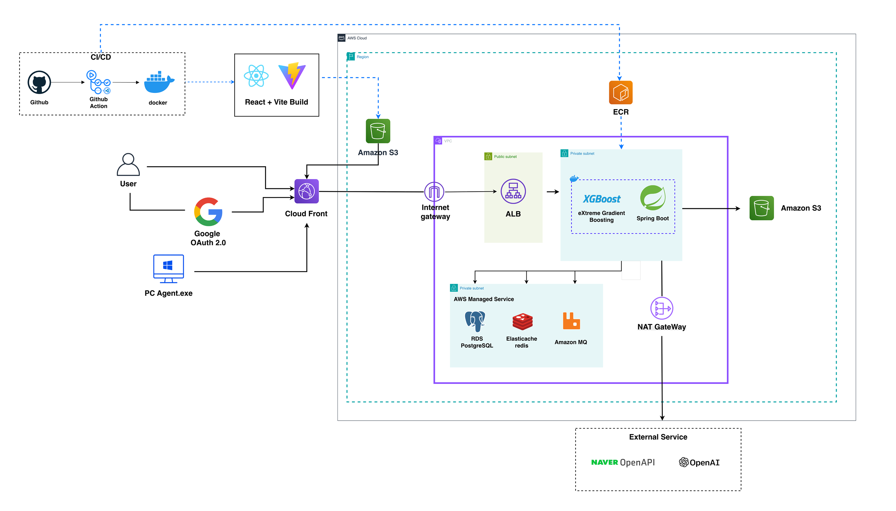

# 다짜조 (Dazzajo)

다짜조는 사용자의 예산과 용도를 입력해  **PC 부품 추천, 호환성 검증, 셀프 견적, 조립 연결, A/S 진단**까지 하나의 흐름으로 제공하는 AI 기반 PC 플랫폼입니다.

단순히 부품 목록만 추천하지 않습니다. AI가 만든 견적을 소켓·전력·크기·성능·가격 규칙으로 다시 검증하고, 추천 근거와 실행 이력을 함께 남겨 사용자가 결과를 확인할 수 있도록 설계했습니다.

## 서비스 소개

- **AI 맞춤 견적**: 예산, 사용 목적, 선호 부품을 해석해 여러 PC 조합을 제안합니다.
- **셀프 견적과 관계 그래프**: 사용자가 직접 고른 부품의 호환 관계와 병목 가능성을 시각적으로 확인합니다.
- **부품·가격 정보**: 내부 부품 데이터와 외부 상품 정보를 결합해 추천과 가격 조회에 활용합니다.
- **검증 가능한 추천**: LLM의 설명과 별개로 호환성·전력·크기·벤치마크 도구가 결과를 판정합니다.
- **PC Agent와 A/S**: Windows PC Agent가 수집한 진단 로그를 바탕으로 장애 원인을 분석하고 상담·접수 흐름으로 연결합니다.
- **조립 중개**: 완성된 견적을 기반으로 조립 요청과 기사 제안을 비교할 수 있습니다.

## 아키텍처 구조도

주요 흐름은 다음과 같습니다.

1. GitHub Actions가 React·Vite 정적 결과물과 Docker 이미지를 빌드합니다.
2. 정적 웹은 Amazon S3에 배포되고 CloudFront를 통해 사용자에게 전달됩니다. 백엔드 이미지는 ECR에서 관리합니다.
3. 사용자, Google OAuth 2.0, PC Agent의 요청은 CloudFront와 ALB를 거쳐 Private Subnet의 애플리케이션으로 전달됩니다.
4. Spring Boot API는 RDS PostgreSQL, ElastiCache Redis, Amazon MQ를 사용하며 XGBoost 서비스와 함께 추천 결과를 만듭니다.
5. 파일 데이터는 S3에 저장하고, 외부 상품·AI 기능은 NAT Gateway를 통해 NAVER Open API와 OpenAI를 호출합니다.

## 기술 스택과 선택 이유

아래 선택 이유는 현재 코드와 운영 구조를 기준으로 정리했습니다.

| 영역 | 기술 | 선택 이유 |
| --- | --- | --- |
| Web | React, TypeScript, Vite, TanStack Query | 견적 보드·관계 그래프·채팅처럼 상태 변화가 많은 화면을 컴포넌트 단위로 나누고, 타입으로 API 계약 오류를 줄이기 위해 선택했습니다. Vite로 개발 서버와 정적 빌드 시간을 줄였습니다. |
| API | Java 21, Spring Boot | 견적·주문·A/S처럼 트랜잭션과 권한 검증이 중요한 도메인을 계층별로 분리하고, Security·Validation·WebSocket·JPA 생태계를 함께 사용하기 위해 선택했습니다. |
| Database | PostgreSQL, pgvector | 사용자·견적·부품·가격·추천 근거 사이의 관계를 트랜잭션으로 보장하면서, JSONB와 벡터 검색까지 하나의 데이터베이스에서 처리하기 위해 선택했습니다. |
| Cache | Redis, Caffeine | 반복되는 AI 응답, 부품 조회, 견적 스냅샷을 재사용해 DB 조회와 외부 API 호출을 줄이기 위해 사용합니다. Redis 장애 시에도 핵심 흐름이 동작하도록 인메모리 캐시와 fallback을 함께 둡니다. |
| Message Queue | RabbitMQ, Amazon MQ | 추천 노출 이벤트와 백그라운드 작업을 사용자 응답 경로에서 분리하고, 처리량 급증 시에도 작업을 순차적으로 소비하기 위해 선택했습니다. |
| ML | Python, XGBoost | 정형화된 부품 특성과 사용자 반응 데이터를 빠르게 학습하고, LLM과 분리된 추천 재정렬기를 shadow 방식으로 검증하기 위해 선택했습니다. |
| PC Agent | Python | Windows 진단 정보와 이벤트 로그를 수집·가공하고 JSONL 형태로 전달하는 시스템 작업을 빠르게 구현하기 위해 선택했습니다. |
| Infra/CI | Docker, GitHub Actions, AWS | 로컬과 배포 환경의 실행 차이를 줄이고, 정적 웹·API·DB·캐시·메시지 브로커를 역할에 맞는 관리형 서비스로 분리하기 위해 선택했습니다. |

## 트러블슈팅 경험

### 1. 호환 후보 평가의 N+1 쿼리 제거

**문제**

셀프 견적에서 부품 후보 50~66개를 평가할 때 후보마다 벤치마크를 조회해 요청 한 번에 최대 후보 수만큼 DB 왕복이 발생했습니다. 벤치마크가 없는 부품은 캐시에 기록되지 않아 같은 조회가 계속 반복됐습니다.

**해결**

- 후보 평가 전에 필요한 벤치마크를 한 번에 배치 조회하도록 변경했습니다.
- 조회 결과가 없는 부품도 빈 값으로 캐시하는 negative caching을 적용했습니다.
- 활성 부품의 카테고리·가격 정렬 쿼리에는 `(category, price, id)` partial index를 추가해 필터와 정렬을 인덱스에서 처리하도록 했습니다.

**결과**

콜드 상태의 벤치마크 쿼리는 약 `M회 → 1회`, 웜 상태는 `B회 → 0회`로 줄었고 관련 전체 테스트 942개를 통과했습니다. 근거는 [N+1 제거 커밋](https://github.com/Cho1022/dazzajo/commit/a24bb586405e19fb2d5bc6f68dfd349b45911f3f)과 [인덱스 마이그레이션](apps/api/src/main/resources/db/migration/V127__parts_active_category_price_index.sql)에 남아 있습니다.

### 2. 견적 Draft 반복 조회로 인한 RDS 부하 감소

**문제**

부하 테스트의 RDS Performance Insights에서 상위 쿼리의 약 절반이 활성 견적 Draft를 다시 읽는 작업이었습니다. 후보 조회, 부품 담기, 호환성 검증이 각각 같은 Draft와 항목을 반복 조회하고 있었습니다.

**해결**

- 사용자 ID를 키로 하는 `QuoteDraftReadCache`를 만들고, 활성 Draft와 항목을 한 번 읽은 스냅샷에서 응답·서명·호환성 입력을 파생했습니다.
- 담기, AI 적용, 수량 변경, 삭제가 커밋되면 캐시를 즉시 무효화해 read-your-writes를 유지했습니다.
- 외부 인스턴스의 변경이 영구히 가려지지 않도록 TTL을 15초로 제한했습니다.

**결과**

후보 조회와 검증 경로의 중복 DB 왕복을 제거했고, 캐시 무효화를 제거하면 실패하는 회귀 테스트를 포함해 전체 968개 테스트를 통과했습니다. 상세 근거는 [Draft 읽기 캐시 커밋](https://github.com/Cho1022/dazzajo/commit/46d1dbf3ec684ebeb64a1b1579d9f03c250e614c)에서 확인할 수 있습니다.

### 3. AI 채팅 메시지 렌더링 지연 개선

**문제**

API 응답은 6~81ms였지만 메시지가 쌓일수록 화면 반영이 1초 이상 늦어졌고, 메시지 30개와 카드 90개 수준에서는 브라우저가 수 초간 멈췄습니다. 새 메시지가 추가될 때 기존 메시지와 카드 전체가 다시 렌더링되는 것이 원인이었습니다.

**해결**

- `ChatMessage`를 메시지 ID 기준으로 메모이제이션했습니다.
- 자식 컴포넌트에 전달하는 콜백 참조를 `useCallback`으로 고정했습니다.
- 새 메시지 한 건이 전체 목록이 아닌 해당 컴포넌트만 갱신하도록 렌더링 비용을 `O(n) → O(1)`로 줄였습니다.

**결과**

메시지 15개 상태에서 새 메시지 렌더링이 12ms로 측정됐고 long task는 발생하지 않았습니다. 측정 방법과 판단 근거는 [Build Chat 성능 계측 노트](docs/build-chat-performance-notes.md)에 기록돼 있습니다.
